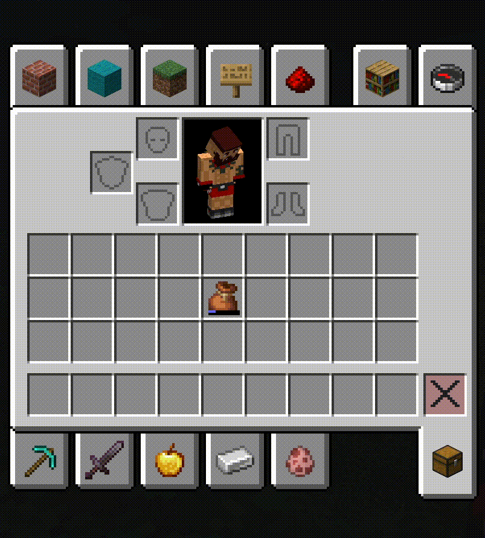
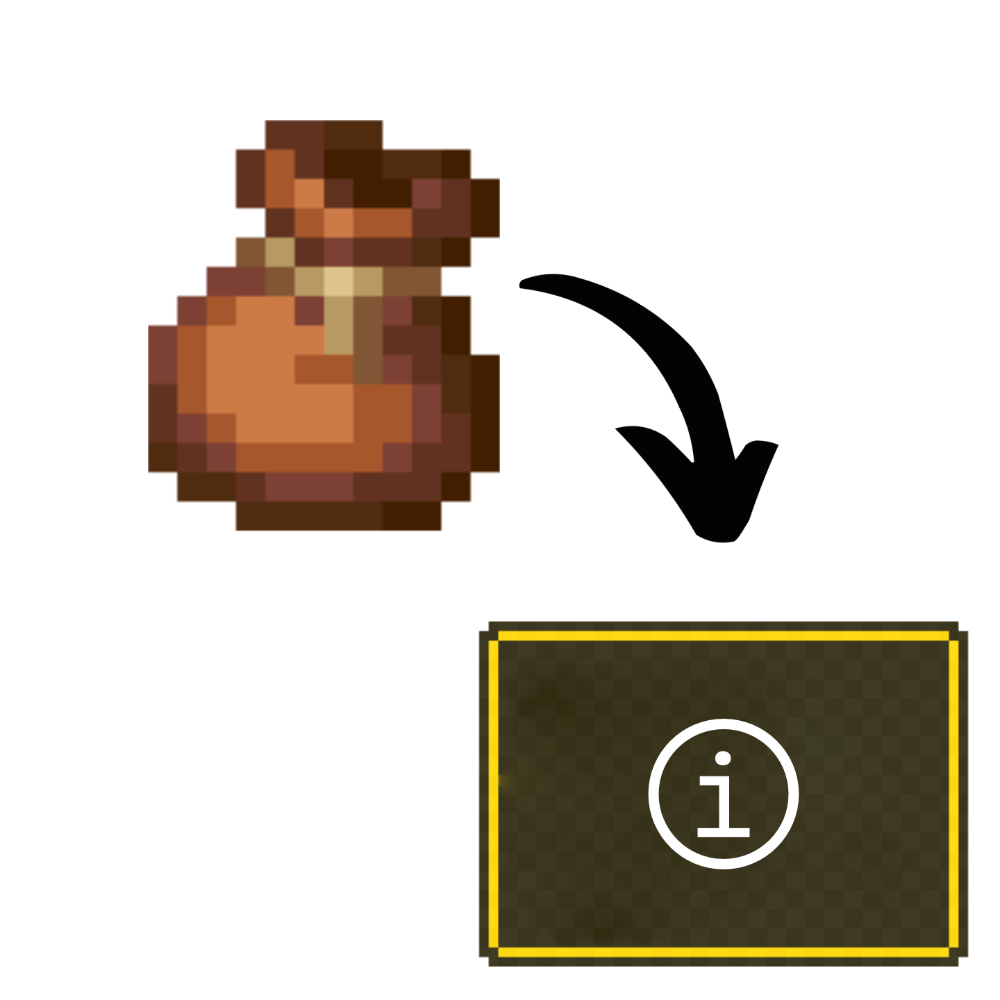

# Bundle In Tooltip (Forge 1.20.1)

Backports the Minecraft 1.21 bundle tooltip interaction to Forge 1.20.1 so you can peek inside any bundle, scroll through its contents, and pull out the exact stack you want without dumping everything on the floor first. Version **1.1.0** brings the full modern UI treatment, right down to the slot spacing, capacity bar facelift, and the optional selection banner.

  

## Features
- Works with vanilla bundles, dyed bundles from **Bundle In Palette**, and any other item in the `forge:bundles` tag.
- Three slot layouts: **Vanilla** (1.21-style rounded cells), **Experiment** (floating icons), and the **Classic** 1.20.1 grid.
- Scroll on a bundle tooltip to highlight the stack you plan to grab, then right-click to withdraw it instantly or left-click to keep filling the bundle without dropping it.
- Optional 1.21-inspired selection banner appears once you scroll, showing the highlighted stack’s name above the tooltip.
- Refined capacity bar with rounded edges, grey outlines, and configurable labels (empty/full text, numeric readout, or none).
- Plays nicely in both singleplayer and multiplayer thanks to lightweight networking sync.

### What’s new in 1.1.0
- Complete visual refresh that mirrors Minecraft 1.21: rounded slot corners, grey slot fill, and a redesigned capacity bar.
- New **Vanilla** vs **Experiment** slot styles plus the untouched **Classic** layout for nostalgia.
- Optional “selection preview” tooltip that scales to the item name and only shows after you scroll.
- Empty bundles now display the “Can hold a mixed stack of items” helper text with proper wrapping.
- Controls fully match 1.21 behavior: carrying a bundle lets you pick up, swap, or deposit stacks without awkward dragging.

## Controls & Flow
1. Hover your mouse over a bundle slot inside any inventory screen.
2. The tooltip opens, showing the contents grid.
3. **Mouse Wheel:** cycle through stacks in the tooltip; the highlighted slot follows your scroll direction.
4. **Right-Click:** while still hovering the original bundle slot, immediately pull the highlighted stack onto your cursor.
5. **Left-Click/Drag:** behaves like vanilla, letting you move the bundle itself even when it contains items.

Tips:
- You can scroll even while the tooltip is partially off-screen; the last valid slot remains selected.
- The interaction ignores empty bundles automatically, so you won’t accidentally pull “air.”

## Configuration
`bundleintooltip-client.toml` (created after first launch) exposes these client-side options. You can edit it by hand or use an in-game config editor such as **Configured** to tweak the settings without leaving Minecraft:

- `tooltip.showCapacityBar` — choose whether the capacity display is the modern 1.21 bar (`true`, default) or the classic numeric fullness line (`false`).
- `tooltip.capacityLabelMode` — controls what text appears inside the bar when it’s visible (defaults to `VANILLA`):
  - `NONE`: leave the bar blank, just like the 1.21 snapshots.
  - `VANILLA`: show the “Empty” / “Full” labels when appropriate.
  - `CLASSIC`: show the classic `24/64` fullness number centered inside the bar.
  - `HYBRID`: mixes both styles (Empty/Full labels at the extremes, numeric in between).
  - `VANILLA_REVISED`: Empty / Filling / Full labels inspired by the preview UI.
- `tooltip.slotTextureMode` — pick between **VANILLA** (rounded, grey slots), **EXPERIMENT** (floating icon prototype), or **CLASSIC** (1.20.1 grid).
- `tooltip.showSelectionBar` — toggles the 1.21-style selection banner that appears after you scroll in a tooltip.

## Requirements
- Minecraft **1.20.1**
- Forge **47.3.0** or newer in the 1.20.1 line

## Installation
1. Install the matching Forge build.
2. Drop the released jar into your `mods/` directory.
3. Launch the game; “Bundle In Tooltip” should appear on the Mods screen.

## Credits
Created by **dmor-me**. Inspired by the official 1.21 bundle UX and designed to complement the dyed bundles from **Bundle In Palette**.

  

